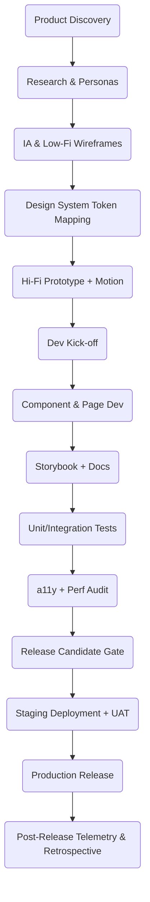

# Standard Operating Procedure (SOP)

**Title:** Enterprise‑Grade UI/UX Development for AgentHive\
**Version:** 1.1   |  **Effective Date:** 2025‑07‑19   |  **Owner:** UX & Front‑End Guild

> **Change Log 1.1** – Expanded coverage for accessibility, performance, design‑token governance, coding conventions, and security hardening.

---

## 1  Purpose

Establish a **repeatable, auditable, and measurable** process that guarantees AgentHive interfaces are:

- Visually **consistent** (align with Design System tokens & components).
- **Accessible** to WCAG 2.2 AA users by design—not retrofit.
- **Performant** (Core Web Vitals ≥ Good thresholds on 95th percentile devices).
- **Secure**, meeting OWASP Top‑10 mitigations for client‑side threats.
- **Observable**, with instrumentation baked in for UX, performance, and error analytics.

## 2  Scope

Applies to **all** React‑based web applications (Admin Hub, data‑viz modules, marketing sites) and any micro‑front‑end or component published to the internal Design System library.

## 3  References

1. **Design System Handbook** (AgentHive‑DS‑001)
2. **WCAG 2.2 AA** and **Section 508** standards
3. **OWASP Top 10 (2025)**
4. **Google Core Web Vitals** documentation
5. **Etsy Performance Engineering Field Guide** (inspiration)
6. **WAI‑ARIA Authoring Practices 1.2**

## 4  Definitions & Acronyms

| Term         | Meaning                                                             |
| ------------ | ------------------------------------------------------------------- |
| **DS**       | Design System: design tokens, figma libraries, Storybook components |
| **IA**       | Information Architecture: hierarchy & labeling of content           |
| **a11y**     | Accessibility (11 letters between a & y)                            |
| **E2E Test** | End‑to‑End automated test (Playwright)                              |
| **DX**       | Developer Experience                                                |
| **PRD**      | Product Requirements Document                                       |
| **JTBD**     | Jobs‑to‑Be‑Done                                                     |

## 5  Roles & Responsibilities

| Role                        | Key Deliverables                                               |
| --------------------------- | -------------------------------------------------------------- |
| **Product Manager (PM)**    | PRD, OKRs, Acceptance Criteria                                 |
| **UX Researcher**           | Surveys, usability test scripts, persona docs                  |
| **UX Designer**             | Wireframes, hi‑fi comps, motion specs, a11y annotations        |
| **Design System Engineer**  | Token governance, component versioning, Chromatic approval     |
| **Front‑End Engineer**      | Implementation, unit/integration tests, perf budgets           |
| **QA / Accessibility Lead** | Automated + manual a11y audits, cross‑browser QA plan          |
| **DevOps Engineer**         | Pipeline templates, bundle‑size reporter, deployment manifests |
| **Release Manager**         | Release checklist, rollback plan, post‑release metrics review  |

## 6  End‑to‑End Process Overview

## 7  Detailed Procedures

### 7.1  Discovery & Research

- **Inputs:** PRD v0, business metrics.
- **Activities:** Stakeholder interviews, competitive analysis, baseline analytics review.
- **Outputs:** Persona sheets, JTBD list, initial success metrics.

### 7.2  Information Architecture & Wireframes

- Align navigation patterns with **IA guidelines**— no more than 2 levels deep.
- Validate via **tree‑testing** and **5‑second tests** (Optimal Workshop).

### 7.3  Design Tokens & High‑Fidelity Design

1. Map color, spacing, typography tokens from `design-tokens.json`.
2. For any **new token**, open a Design System Change Request (DSCR) Jira ticket; DS Engineer reviews within 48 h.
3. Annotate interaction states (focus ring, disabled, loading). Provide motion spec (duration, easing) following **Material Design motion guidelines**.
4. Export **Zeplin/Figma Dev mode** redlines for spacing & font

### 7.4  Component Development & Coding Conventions

| # | Convention                                                             | Rationale                   |
| - | ---------------------------------------------------------------------- | --------------------------- |
| 1 | Files colocated per component (`Button/Button.tsx`,`Button/index.ts`)  | Faster discovery            |
| 2 | Use React Function Components + Hooks, no class components             | Simpler mental model        |
| 3 | Tailwind utility classes only—**no inline CSS**                        | DS token inheritance        |
| 4 | Props validated via TypeScript interfaces & `zod` where runtime needed | Type safety + runtime guard |
| 5 | **Storybook DocsPage** enabled with JSDoc pulled from source           | Live docs                   |

#### State Management

- Global: **Zustand** slices (`useAuthStore`, `useThemeStore`).
- Remote data: **TanStack Query** with stale‑while‑revalidate.
- Avoid context prop‑drill; instead expose hooks from `packages/hooks`.

#### Testing Targets

| Layer                   | Tool                  | Coverage Target                   |
| ----------------------- | --------------------- | --------------------------------- |
| Unit (functions, utils) | Vitest                | 95 % lines                        |
| Component               | React Testing Library | 90 % branches                     |
| Visual Regression       | Chromatic             | Pixel diff on viewport 1440 × 900 |
| E2E                     | Playwright            | Critical flows > 3 locales        |

### 7.5  Accessibility (a11y) Requirements

- **Keyboard:** Tab order follows DOM; focus indicator ≥ 2 px.
- **Screen Reader:** All interactive elements have semantic roles & labels.
- **Color Contrast:** ≥ 4.5:1 text; ≥ 3:1 UI objects.
- **Motion:** Provide reduced motion preference— disables parallax, heavy animation.
- **Audit:** Run `axe-core` CLI in CI; manual NVDA check once per release.

### 7.6  Performance Budgets

| Metric                         | Budget (95th percentile)    |
| ------------------------------ | --------------------------- |
| Largest Contentful Paint (LCP) | ≤ 2.5 s                     |
| First Input Delay (FID) / INP  | ≤ 100 ms                    |
| Total Blocking Time (TBT)      | ≤ 150 ms                    |
| Cumulative Layout Shift (CLS)  | ≤ 0.1                       |
| JS Bundle ≤                    | 100 KB per route (pre‑gzip) |

Enforced via **bundlesize GitHub Action** + Lighthouse CI.

### 7.7  Security Hardening

- **CSP** headers via Netlify/Ingress: block `unsafe‑inline` scripts.
- **Subresource Integrity (SRI)** for external scripts.
- Sanitize user‑supplied HTML with `DOMPurify`.
- Lint JavaScript with `eslint-plugin-security`.

### 7.8  Quality Assurance & Release Gates

- Automated gates in CI:
  - ESLint / Prettier pass.
  - Unit + integration tests ≥ coverage threshold.
  - Lighthouse a11y & perf budgets.
  - Bundle size report < budget.
  - Chromatic visual diff approved.
- Manual gates:
  - a11y expert keyboard & screen‑reader smoke test.
  - PM acceptance review in staging.

### 7.9  Deployment & Rollback

- GitOps via **ArgoCD**; images tagged with Git SHA & semantic version.
- **Blue/Green** deploy for zero downtime.
- Rollback by toggling active service in ArgoCD UI; automated DB migration reversal script where possible.

### 7.10  Post‑Release Monitoring & Continuous Improvement

1. **Datadog RUM** dashboards for CWV + JS errors.
2. **Sentry** alerts: threshold 0.1 % error rate 5 min rolling.
3. **UX Funnel** (PostHog): track path abandonment; trigger follow‑up usability sessions if < 75 % completion.
4. Schedule **quarterly UX audit** and **bi‑annual design system review**.

## 8  Deliverables & Artifacts (Expanded)

| Phase        | Artifact                                              | Storage Location           |
| ------------ | ----------------------------------------------------- | -------------------------- |
| Research     | Interview notes, persona deck                         | Confluence › UX/Research   |
| IA/Wireframe | Low‑fi Figma link, tree‑test results                  | Figma Project & Confluence |
| Design       | Final Figma spec, motion prototype                    | Figma › AgentHive VNext    |
| Dev          | Pull Request, Storybook build URL, bundle‑size report | GitHub, Chromatic          |
| QA           | a11y audit doc, Lighthouse CI JSON, Playwright video  | GitHub Artifacts           |
| Release      | Changelog, Git tag, ArgoCD release link               | GitHub Releases            |
| Post‑Release | Datadog dashboard link, Sentry report, Retro doc      | Confluence Retro Space     |

## 9  Tools & Repositories

| Category       | Tool                                     | Purpose                                |
| -------------- | ---------------------------------------- | -------------------------------------- |
| Design         | **Figma**, **FigJam**                    | Visual design & collaboration          |
| Documentation  | **Confluence**                           | SOP, research, retros                  |
| Component Docs | **Storybook** + **Chromatic**            | Living component library & visual diff |
| CI/CD          | **GitHub Actions**, **ArgoCD**           | Automation & GitOps promotion          |
| Monitoring     | **Datadog RUM**, **Sentry**, **PostHog** | Performance, errors, UX metrics        |
| Secrets        | **HashiCorp Vault**                      | Environment & API keys                 |

## 10  Quality Gates – RACI Matrix (Revised)

| Gate                 | R        | A                  | C            | I  |
| -------------------- | -------- | ------------------ | ------------ | -- |
| Design Crit Pass     | UX Lead  | Design Director    | PM, Dev Lead | QA |
| Storybook Build      | Dev Lead | DS Engineer        | UX           | QA |
| a11y ≥ 90 & Axe Pass | QA Lead  | Accessibility Head | Dev          | PM |
| Perf Budget          | DevOps   | Front‑End Lead     | QA           | PM |
| Security Scan Pass   | Dev Lead | Security Engineer  | DevOps       | PM |

## 11  Revision History

| Date       | Version | Author        | Notes                                                    |
| ---------- | ------- | ------------- | -------------------------------------------------------- |
| 2025‑07‑19 | 1.0     | UX & FE Guild | Initial release                                          |
| 2025‑07‑19 | 1.1     | UX & FE Guild | Added detailed guidelines, metrics, and security section |

---

**End of SOP**

